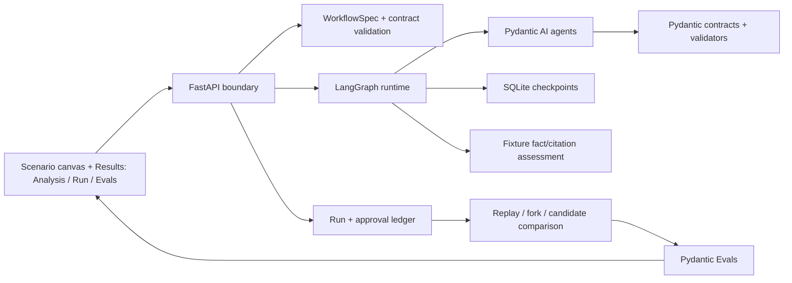
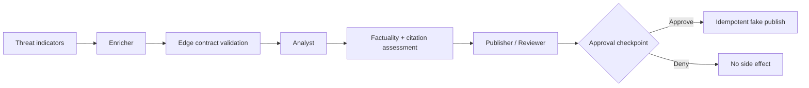

# ReAgent

### An executable pre-production reliability lab for multi-agent systems

[](https://github.com/Alred-79/hackprinceton-final/actions/workflows/ci.yml)


**Winner — HackPrinceton Spring 2026, Best Use of Enter.pro.** [View the original project on Devpost.](https://devpost.com/software/reagent)

**Live deployment:** [Open ReAgent on Railway](https://reagent-production-4a20.up.railway.app)

ReAgent turns an agent architecture from a hopeful diagram into an inspectable systems experiment. Engineers can generate or edit a workflow, place explicit schema/context/approval boundaries, execute eight deterministic LangGraph runtimes, inspect Pydantic enforcement events, replay or fork durable checkpoints, and evaluate exactly how failures propagate across agents.

This is not a chat UI wrapped around a model. It is a full-stack reliability workbench built around the control-plane problems that matter once an agent reaches a real environment: typed handoffs, evidence provenance, context budgets, bounded tool authority, human approval, idempotency, replay, and honest measurement.


## Why this matters in production

Multi-agent failures rarely stay local. A valid JSON object can still contain a false claim. A large tool catalog can consume the model's useful context. A retry can repeat an irreversible side effect. A malformed handoff can poison every downstream agent while the top-level run still appears successful.

ReAgent makes those failure boundaries visible and executable:

| Production risk | ReAgent control | Evidence exposed in the UI |
|---|---|---|
| Schema-valid but unsupported output | Pydantic contract **plus** independent factuality/citation checks | Retry transcript, validation path, claim-to-source result |
| Agent-to-agent contract drift | Post-agent `TypeAdapter` gate | Exact rejected edge, field path, expected and received shape |
| Context overload or retrieval noise | Configurable Context Boundary and deterministic Knowledge Retrieval | Selected sources, token policy, ranked chunks, precision/recall inputs |
| Excessive or ambiguous tool access | Scoped MCP catalogs and registered operation IDs | Exposed schemas, selected tool, arguments, trajectory violations |
| Unsafe or duplicated side effects | Durable approval checkpoint and idempotency ledger | Approval binding, checkpoint identity, replay rejection, side-effect count |
| Non-reproducible regressions | Frozen fixtures, semantic trace hashes, replay/fork/candidate comparison | Event timeline, provenance, candidate diff, linked eval case |

## Two complementary product experiences

### 1. Workflow Architect — design the controls humans must own

Describe a workflow and ReAgent generates the mechanical backbone while deliberately leaving policy decisions open. Drag **Schema Contract**, **Context Boundary**, or **Human Review** blocks into highlighted edge sockets, then configure the decisions an agent should not silently invent:

- strict versus unknown-field stripping, required fields, and violation routing;
- context budget, selection/compaction strategy, allowed sources, and blocked fields;
- approval boundaries before notifications, code execution, writes, and other side effects.

Generated automation nodes stay visually quiet; assurance decisions are emphasized. Desktop drag-and-drop, exact-edge insertion, keyboard selection, and touch fallback all commit through the same atomic graph validator. The preview is deterministic and explicitly labels what is configured, simulated, or not measured.

### 2. Scenario Lab — break, harden, execute, and evaluate

Eight scenario-owned runtimes turn common failure modes into reproducible engineering exercises. Each canvas keeps **Analysis**, **Run**, and **Evals** together so the user can connect a graph decision to its runtime consequence without switching to a detached lab.

- Run baseline and hardened candidates against the same frozen fixture.
- Inspect typed output retries separately from inter-agent edge rejection.
- Trace evidence loss, unsupported claims, tool misuse, approval pauses, and downstream containment.
- Replay the same candidate, fork from a durable checkpoint, or rerun a deliberately changed candidate.
- Open the linked Pydantic Evals case and assertion evidence.

## Engineering highlights

- **Built a LangGraph reliability runtime with durable state**, including pause/resume, checkpoint fork, semantic replay, candidate comparison, server-owned approvals, and idempotent fake side effects.
- **Shipped two distinct Pydantic enforcement layers**: Pydantic AI typed-output repair inside an agent run and post-agent `TypeAdapter` rejection at handoff boundaries.
- **Separated five guarantees that agent platforms frequently conflate**—contract validity, factuality, citation support, policy compliance, and task quality—so a perfectly typed response can still fail an independent evidence check.
- **Built a graph-authoritative Assurance Workbench**: the visible `SimNode[]`/`SimEdge[]` canvas compiles into a versioned semantic identity; registered operation IDs—not display labels—select runtime code.
- **Turned “Tool RAG” into inspectable Knowledge Retrieval**: scenario-bound frozen corpora execute deterministic BM25, stable token-hash vector, or hybrid ranking and expose the exact ranked evidence and metric inputs.
- **Designed for epistemic honesty**: observed runtime metrics, calculated design estimates, deterministic fixture outcomes, and unmeasured properties never collapse into a fake “reliability percentage.”
- **Backed the product with an extensible Pydantic Evals library** spanning tool misuse, context overflow, compact/handoff loss, citation drift, false-claim propagation, MCP exposure, and approval replay.

## What this project demonstrates

- Systems design across a React graph editor, a strict FastAPI boundary, LangGraph orchestration, SQLite durability, and deterministic evaluation infrastructure.
- Production-minded correctness: canonical graph identity, bounded retries, strict DTOs, fail-closed registries, idempotency, provenance, and replay semantics.
- Developer experience: one-command verification, offline fixtures with no provider key, responsive/accessibility coverage, and CI-pinned browser tests.
- Clear technical judgment about where schemas help—and where semantic verification, policy, authorization, or human review are still required.

## The engineering problem

Multi-agent failures rarely stay local. A malformed handoff can break a downstream consumer; a validly typed false claim can gain confidence as agents repeat it; a large MCP catalog can consume context before useful work begins; and an approval flow can double-execute a side effect after retry or resume.

Most visual workflow tools describe these risks without exercising them. ReAgent creates a thin, local runtime where each boundary is visible:

- What did the agent actually emit?
- Did repair happen inside the model run or at the graph edge?
- Which claims and constraints survived each hop?
- Where did the graph pause, and what exactly was approved?
- Did a rerun reproduce the same semantic trace?
- Is a number observed, calculated, assumed, or not measured?

## System architecture



| Layer | Responsibility | Implementation |
|---|---|---|
| Orchestration | Branches, state transitions, checkpoints, interrupts, downstream fork | LangGraph `StateGraph` + SQLite checkpointer |
| Agent execution | Typed outputs, dependency injection, validation retry, deferred tools | Pydantic AI `Agent` + deterministic `FunctionModel` fixtures |
| Inter-agent contracts | Registered payloads, handoff envelopes, edge validation | Pydantic models + `TypeAdapter` |
| Evaluation | Versioned cases, mutation plans, custom assertions, reports | Pydantic Evals `Dataset` + custom `Evaluator` |
| Tool discovery | Real initialize/list/call path against 5/25/100-tool catalogs | FastMCP + Pydantic AI `MCPToolset` |
| Knowledge retrieval | Ranked frozen evidence, BM25/vector/hybrid comparison, fixture-grounded metrics | Deterministic retrieval registry + run event contract |
| Durability | Runs, checkpoint identity, approvals, idempotent fake side effects | SQLite |
| Product surface | Timeline, cascade view, approval controls, paired results, replay receipt | React + TypeScript + Vite |

## Executable scenario lab

Every scenario owns strict input, handoff, and output contracts; deterministic teaching fixtures; a baseline/hardened pair; independent quality checks; and a versioned Pydantic Evals suite.

Executors expose one **Output Contract** control. The registered Pydantic model is the sole editable source of truth; its provider-facing JSON Schema, version, and digest are generated automatically and available only as read-only inspection evidence. Threat, incident, and diligence terminal contracts preserve their earlier thin v1 shapes for replay while new candidates bind to richer v2 domain models.

| Scenario | Failure under test | Hardened control |
|---|---|---|
| Threat Analyst | Schema-valid unsupported attribution | Factuality/citation verification + approval |
| Bloated Swarm | Wrong routing, tool misuse, agent bloat | Grounded routing + bounded action policy |
| MCP Migration | Catalog bloat and cross-domain tool selection | Scoped MCP exposure + typed tool arguments |
| Safety Net | Partial file data mislabeled as complete | Discriminated failure result + typed fallback |
| Gold Plater | Schema-valid scope and budget overrun | Explicit authorization, scope, and budget invariants |
| Content Machine | Citation drift and unsupported publication | Claim-to-source lineage + publication blocking |
| Ops Center | Duplicate, unauthorized, or out-of-order action | Idempotency, dependency, and approval checks |
| Due Diligence Engine | Unjustified confidence over weak evidence | Coverage/freshness gates + typed escalation |

The guided fixture lab in each scenario explains what Pydantic proves, displays the exact retry or edge-validation error, exposes the relevant JSON Schema, and then shows where independent factuality, citation, policy, or task-quality checks can still fail.

Threat Analyst, Ops Center, and Due Diligence starters also include a real **Knowledge Retrieval** step. Its strategy and top-k are canvas configuration, not decorative controls: compile binds them into the candidate, execution ranks the registered scenario corpus, and Results exposes the exact chunks and metric inputs. The metrics are deliberately labeled **RAGAS-aligned deterministic fixture metrics** rather than official RAGAS/LLM-judge output. Faithfulness stays **Not measured** at the retrieval boundary because no generated answer exists there.

## Approval-enabled Threat Analyst flagship

The claim-earning path is intentionally narrow: one deterministic Threat Analyst workflow with three Pydantic AI agents.



The deterministic fixture deliberately introduces a state-sponsorship attribution that is structurally valid but unsupported by the fixture ledger. The UI contrasts two candidates:

| Candidate | Behavior | What the trace demonstrates |
|---|---|---|
| Baseline | Unsupported attribution reaches the critical output | Schema validity does not imply truth |
| Hardened | Factuality/citation stage rejects the attribution before an approval-gated publish | Semantic verification and policy enforcement are separate controls |

The current fixture is a deterministic demonstration scaffold, not a general hallucination detector or an empirical production reliability study.

## Two distinct enforcement layers

ReAgent records contract failures according to where they occur:

1. **Inside the agent run:** malformed model output fails the declared Pydantic AI `output_type`, produces a retry, and is recorded as `agent_output_retry`.
2. **Between agents:** a post-output mutation fails edge `TypeAdapter` validation and is recorded independently as `edge_contract_rejected`.

That distinction matters operationally. Model repair, producer/consumer incompatibility, and workflow routing are different failure domains and should not collapse into one generic “validation failed” metric.

## Failure-mode library

The starter Pydantic Evals suite contains eight versioned cases:

| Case | Failure surface | Evidence produced |
|---|---|---|
| Contract drift | Required handoff field is removed | Edge rejection and bounded recovery record |
| Tool misuse | Unauthorized tool and invalid arguments | Exact trajectory violations |
| Context overflow | Fixture history exceeds a configured budget | Preflight failure vs compacted variant |
| Handoff loss | Naive truncation removes a required constraint | Retention comparison |
| Citation drift | Source ID is swapped or invented | Integrity vs support distinction |
| Cascading false claim | Typed but unsupported attribution crosses agents | Escape vs containment comparison |
| MCP bloat | 5, 25, and 100 similar tools are exposed | Real MCP tool listing/call and schema-token exposure |
| HITL break | Approval is denied or replayed | Zero side effects and replay rejection |

Some starter cases are deterministic evaluator probes rather than full workflow injections. The design keeps mutation/evaluator logic outside the LangGraph runner so cases can be promoted independently without rewriting orchestration.

## Durable approval protocol

The browser never resubmits trusted messages or tool arguments. A resume request contains only:

- run ID;
- pending approval ID;
- approve/deny decision;
- idempotency key.

The server binds the pending operation to the LangGraph checkpoint, tool-call ID, validated-argument hash, and configuration hash. The fake publish operation uses `(run_id, tool_call_id)` as its idempotency key, so duplicate resume or graph re-execution cannot publish twice.

## Replay, fork, and candidate rerun are different operations

- **Checkpoint fork:** seeds a new LangGraph thread from a stored checkpoint and re-executes only downstream nodes.
- **Fixture replay:** executes the same deterministic fixture configuration and compares a semantic trace hash that excludes IDs and timing noise.
- **Candidate rerun:** executes the case against a deliberately changed variant or configuration and labels it as a comparison, not a replay.

The current replay implementation is deterministic re-execution with semantic comparison. A stored `ModelResponse`/tool-fixture index with fail-closed fingerprint lookup is the next hardening milestone.

## Honest metrics

ReAgent avoids presenting architecture intuition as empirical probability.

- Execute mode reports request counts, tokens, duration, tool calls, contract events, cascade findings, and approval paths from normalized runtime events.
- Fixture cost is **Not measured** because there is no provider bill.
- Design-mode cost and latency are estimates with visible token, pricing, loop, and routing assumptions.
- The static graph rubric is named **Scenario readiness**, never reliability.
- Fixture outcomes are deterministic regression results and are never pooled with live-model statistics.
- Knowledge Retrieval reports rank-aware context precision, ID-based context recall, and normalized score relevance from frozen labels. It does not claim production embedding quality; “vector” is a stable token-hash teaching baseline, and faithfulness requires a downstream answer.

## Runtime API

```text
POST /api/workflows/validate
POST /api/runs
GET  /api/runs/{run_id}
POST /api/runs/{run_id}/resume
POST /api/runs/{run_id}/checkpoint-fork
POST /api/runs/{run_id}/fixture-replay
POST /api/runs/{run_id}/candidate-rerun
POST /api/evals/run

# Opt-in graph-authoritative Assurance Workbench
GET  /api/assurance/capabilities/{scenario_id}
POST /api/assurance/compile
POST /api/assurance/runs
POST /api/assurance/evals
```

FastAPI publishes the complete OpenAPI contract at `http://localhost:8000/docs`.

## Run locally

Requirements: Node.js, pnpm, Python 3.12–3.14, and [uv](https://docs.astral.sh/uv/).

```bash
pnpm install
cd runtime && uv sync && cd ..
```

Start the API and frontend in separate terminals:

```bash
pnpm dev:runtime
```

```bash
pnpm dev
```

Then open:

- `http://localhost:8080/architect` for the Workflow Architect;
- `http://localhost:8080/app` for the eight-scenario lab;
- `http://localhost:8000/docs` for the generated OpenAPI explorer.

The registered scenario runtimes remain the default. To enable the graph-authoritative Assurance Workbench, opt in on both sides instead:

```bash
REAGENT_ASSURANCE_V1=true pnpm dev:runtime
```

```bash
VITE_ASSURANCE_V1=true pnpm dev
```

Open any scenario and use **Results → Analysis / Run / Evals** without leaving the canvas. **Analyze Design** reports heuristic architecture feedback; legacy **Run Workflow** executes the registered backend. In the optional Assurance Workbench, explicitly bind canvas nodes to allowlisted operations, add typed handoff/evidence nodes, compile the current graph, then compare clean, malformed-output, and schema-valid-falsehood fixtures against the same candidate.

Core fixture execution requires no provider key. The runtime sets `pydantic_ai.models.ALLOW_MODEL_REQUESTS = False` before fixture runs.

## Deploy on Railway

The checked-in `Dockerfile` builds the Vite frontend and serves it from the FastAPI application, so the complete product runs from one public origin. `railway.toml` configures the health check and restart policy.

For durable SQLite and LangGraph checkpoint state, attach a Railway volume at `/data` and set:

```text
REAGENT_DATA_DIR=/data
REAGENT_STATIC_DIR=/app/dist
REAGENT_ASSURANCE_V1=true
```

The production frontend uses same-origin `/api/*` requests automatically. Local development continues to default to `http://localhost:8000`.

## Verification

```bash
pnpm check
```

The repository currently ships:

- 216 Python tests covering all eight registered workflows and assurance adapters, strict wire contracts, graph-authoritative compilation, deterministic BM25/vector/hybrid retrieval, real agent output repair, TypeAdapter gate routing, independent evidence failures, linked Pydantic Evals, idempotency, checkpoint pause/resume/fork, approvals, replay, MCP, and API paths;
- 125 frontend tests covering semantic graph identity, atomic policy-gate insertion, retrieval configuration and evidence contracts, position-vs-config staleness, all-eight causal fixtures, lifecycle cleanup, cost units, parallel critical-path latency, insertion-order invariance, metric labeling, offline capability fallback, binding-dialog and post-run inspector interactions, and strict response boundaries;
- 16 pinned Chromium tests covering desktop drag-and-drop, exact-edge insertion, keyboard/touch alternatives, real-template geometry, capacity behavior, responsive layout, reduced motion, and route isolation;
- Ruff, ESLint, production Vite build, and three-lane GitHub Actions verification.

## Repository map

```text
src/
  features/architect/     Local compiler, graph validator, policy slots, canonical preview
  components/architect/   Drag-and-drop decision blocks and responsive workflow canvas
  pages/runtime/          Expandable execution/eval evidence and comparisons
  engine/                 Honest design-mode heuristic analysis
  components/simulator/  Design canvas plus feature-gated Assurance Workbench
  lib/assuranceGraph.ts   Canonical current-canvas serializer and semantic identity

runtime/
  reagent_runtime/
    agents.py             Pydantic AI agents and deterministic models
    engine.py             LangGraph execution, checkpoints, replay, fork
    workflows.py          Registered contracts and topology validation
    provenance.py         Fixture source/fact/citation assessment
    store.py              SQLite run, approval, and idempotency ledger
    evals.py              Cross-cutting Pydantic Evals failure-mode library
    assurance/            Strict DTOs, registries, compiler, persistence, causal runner
      retrieval.py        Frozen corpora plus deterministic BM25/vector/hybrid evidence
    scenarios/            Eight scenario-owned contract/fixture/eval modules
    api.py                FastAPI boundary
  tests/                  Runtime, compiler, replay, HITL, MCP, eval, API tests
```

## Scope and hardening roadmap

The current system is an engineering prototype with eight executable fixture workflows. The most important next steps are:

1. promote the opt-in Assurance Workbench after more provider/model compatibility and migration testing;
2. move all scenario fixtures behind fail-closed response and tool fingerprints;
3. verify handoff integrity hashes on receipt and expand authoritative semantic/paraphrase matching;
4. store model/tool fixtures behind fail-closed prompt, contract, and tool-schema fingerprints;
5. promote context/tool cases from deterministic probes into end-to-end injected workflow runs;
6. add live-model calibration without mixing fixture results into empirical statistics.

This scope is deliberate: ReAgent demonstrates the control-plane mechanics required to test agent systems without claiming production authorization, distributed durability, or general-purpose hallucination detection.
